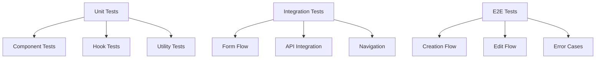
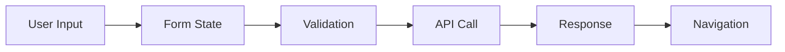

# Challenge Generator Documentation

> **⚠️ DOCUMENTATION UPDATE REQUIRED**
> When modifying any files in this directory, you MUST review and update this documentation.
> Follow this process:
> 1. Before making changes, review the relevant sections of this document
> 2. After making changes, update this document if needed
> 3. Check the Documentation Update Checklist below
> 4. Review related documentation in:
>    - `/components/dashboard/challenges/DOCUMENTATION.md`
>    - `/components/dashboard/test/DOCUMENTATION.md`

## Directory Structure
```
challenge-generator/
├── components/
│   ├── ChallengeInstructions.tsx  # Challenge instruction editor
│   ├── ChallengeSettings.tsx      # Challenge configuration settings
│   ├── ChallengeSuggestions.tsx   # AI-powered challenge suggestions
│   └── GuideContent.tsx           # Guide and help content
├── index.tsx                      # Main container component
├── page.tsx                       # Server-side entry point
└── schema.ts                      # Type definitions and validations
```

## Dependencies

### Core Dependencies
- `next.js`: Framework for routing and server-side rendering
- `@supabase/supabase-js`: Database and authentication
- `react-hook-form`: Form management
- `@hookform/resolvers/zod`: Form validation
- `sonner`: Toast notifications
- `lucide-react`: Icons

### UI Components
- `@/components/ui/tabs`: Tab navigation
- `@/components/layout`: Dashboard layout

### Custom Hooks
- `useAuthCheck`: Authentication state management
- `useChallengeFormats`: Format loading and management
- `useChallengeSuggestions`: AI suggestion handling
- `useInstructionGenerator`: Instruction generation
- `useChallengeSubmission`: Challenge submission handling

## Core Components

### 1. Challenge Generator Container (index.tsx)
The main container component that orchestrates both challenge creation and editing:
- Manages the overall state and workflow
- Coordinates between sub-components
- Handles form submission and validation
- Integrates with AI services for suggestions
- Supports both creation and editing of challenges

### 2. Sub-Components

#### ChallengeInstructions
```typescript
interface ChallengeInstructionsProps {
  form: UseFormReturn<FormValues>;
  isGenerating: boolean;
  onGenerateInstructions: (title: string) => Promise<void>;
}
```
Rich text editor for challenge instructions with AI generation support.

#### ChallengeSettings
```typescript
interface ChallengeSettingsProps {
  form: UseFormReturn<FormValues>;
  formats: ChallengeFormat[];
  groupedFormats: GroupedFormats;
  loadFormats: (difficulty: string) => Promise<void>;
  isGenerating: boolean;
  generateSuggestions: () => Promise<void>;
}
```
Configuration panel for challenge parameters with format management.

#### ChallengeSuggestions
```typescript
interface ChallengeSuggestionsProps {
  suggestions: Suggestion[];
  isGenerating: boolean;
  onSelect: (suggestion: Suggestion) => void;
}
```
AI-powered suggestion interface with selection handling.

#### GuideContent
```typescript
interface GuideContentProps {
  difficulty: string;
  format: string;
}
```
Context-aware help and guidance content.

## Server Component (page.tsx)

### Overview
The server-side entry point for the Challenge Generator, handling:
- User authentication
- Challenge data fetching for edit mode
- URL parameter processing
- Ownership verification

### Implementation
```typescript
// Props type for searchParams handling
interface Props {
  searchParams: { [key: string]: string | string[] | undefined };
}

// Server Component with async searchParams handling
async function ChallengeGeneratorPage({ searchParams }: Props)
```

### URL Parameters Handling
- **Next.js 13+ Considerations**
  - searchParams must be handled asynchronously
  - Direct property access needs special handling
  - Type safety must be maintained

- **Parameter Extraction**
  ```typescript
  // Safe parameter extraction pattern
  const params = await Promise.resolve(searchParams);
  const mode = String(params?.mode || '');
  const challengeId = String(params?.id || '');
  ```

- **Available Parameters**
  - `mode`: Operation mode ('edit' or undefined)
  - `id`: Challenge ID for edit mode

### Security Features
1. **URL Parameter Validation**
   - Async-safe parameter extraction
   - Type-safe conversion
   - Default value handling
   - Protection against undefined/null

2. **Authentication Flow**
   - Server-side user verification
   - Redirect to signin if unauthenticated
   - Ownership validation for edit mode

3. **Edit Mode Protection**
   - Challenge ownership verification
   - Automatic redirect on unauthorized access
   - Error handling for invalid challenge IDs

### Data Flow
1. Await and validate URL parameters
2. Verify user authentication
3. If edit mode:
   - Fetch challenge data
   - Verify ownership
   - Prepare for editing
4. Render ChallengeGeneratorView with appropriate props

### Type Safety
```typescript
// Type-safe challenge handling
let challengeToEdit: Challenge | undefined = undefined;

// Safe parameter type conversion
const mode: string = String(params?.mode || '');
const challengeId: string = String(params?.id || '');
```

### Error Handling
1. **Parameter Validation**
   - Async parameter resolution
   - Safe type conversion
   - Default value fallbacks
   - Protection against malformed input

2. **Authentication Failures**
   - Redirect to signin page
   - Clear error messaging
   - Session state handling

3. **Edit Mode Errors**
   - Invalid challenge ID handling
   - Unauthorized access protection
   - Database error management

### Next.js 13+ Best Practices
1. **Async Parameter Handling**
   - Always await searchParams resolution
   - Use type-safe parameter extraction
   - Handle undefined/null cases
   - Provide default values

2. **Route Protection**
   - Server-side authentication checks
   - Proper redirect handling
   - Error boundary implementation

3. **Performance Considerations**
   - Efficient parameter parsing
   - Proper async/await usage
   - Optimized database queries
   - Response caching when appropriate

## Component Behaviors

### Format Selection (ChallengeSettings.tsx)

#### Format Loading Flow
1. **Initial Load**
   - Formats are loaded based on initial difficulty
   - Grouped by difficulty level
   - Cached for performance

2. **Difficulty Change**
   ```typescript
   // Format loading on difficulty change
   const loadFormats = async (difficulty: string) => {
     // Load formats for the selected difficulty
     // Update groupedFormats state
   };
   ```

#### State Management
1. **Format Groups**
   ```typescript
   interface GroupedFormats {
     [difficulty: string]: ChallengeFormat[];
   }
   ```
   - Formats are grouped by difficulty
   - Each group contains format objects
   - Maintained in component state

2. **Selection State**
   - Current format selection preserved in form state
   - Format list updates on difficulty change
   - Previous selection cleared if not available in new difficulty

#### Known Issues
1. **Format List Flickering**
   - **Symptom**: Visual glitch when switching difficulties
   - **Cause**: Async format loading and state updates
   - **Impact**: UI flickers briefly during format reload
   - **Affected Components**:
     - Select dropdown
     - Format groups
     - Selected value

2. **Loading States**
   - Format loading may show temporary empty state
   - Dropdown might briefly show loading placeholder
   - Group headers may shift during reload

#### Performance Considerations
1. **Format Caching**
   - Consider caching formats by difficulty
   - Implement format preloading
   - Use optimistic updates

2. **State Updates**
   - Minimize cascading updates
   - Implement proper loading states
   - Handle race conditions

3. **UI Stability**
   - Add loading indicators
   - Maintain consistent heights
   - Prevent layout shifts

#### Best Practices
1. **Format Loading**
   - Pre-fetch common formats
   - Cache loaded formats
   - Handle loading errors gracefully

2. **State Management**
   - Use proper loading states
   - Implement optimistic updates
   - Handle edge cases (empty lists, errors)

3. **UI/UX**
   - Show loading indicators
   - Maintain consistent layout
   - Prevent unnecessary re-renders

### Format Loading and State Management (Updated)

#### Format Loading Mechanism

The challenge generator now implements an optimized format loading mechanism with the following features:

1. **Global Format Cache**
```typescript
const CACHE_DURATION = 5 * 60 * 1000; // 5 minutes
const formatCache: FormatCache = {};
```
- Formats are cached at module level for persistence between component mounts
- Cache duration is set to 5 minutes to balance freshness and performance
- Cache is keyed by difficulty level for targeted invalidation

2. **State Management**
```typescript
const { formats, groupedFormats, loadFormats, isLoading } = useChallengeFormats(
  supabase,
  form.getValues('difficulty')
);
```
- Format state is managed through a dedicated hook
- Loading states are properly tracked and exposed
- Formats are grouped by difficulty level for organized display

3. **Format Loading Hook**
```typescript
export function useChallengeFormats(supabase: SupabaseClient, initialDifficulty: string) {
  // State initialization
  const updateFormatsState = useCallback((formatsData: ChallengeFormat[]) => {
    setFormats(formatsData);
    setGroupedFormats(/* grouping logic */);
  }, []);

  const loadFormats = useCallback(async (difficulty: string) => {
    // Cache check and format loading logic
  }, [supabase, updateFormatsState]);

  // Initial format loading
  useEffect(() => {
    loadFormats(initialDifficulty);
  }, [initialDifficulty, loadFormats]);
}
```
- Uses `useCallback` for stable function references
- Implements proper cleanup and error handling
- Provides consistent state updates through `updateFormatsState`

4. **Form Integration**
```typescript
useEffect(() => {
  const subscription = form.watch((value, { name }) => {
    if (name === 'difficulty' && value.difficulty) {
      loadFormats(value.difficulty);
    }
  });
  return () => subscription.unsubscribe();
}, [form, loadFormats]);
```
- Form changes trigger format loading through subscription
- Proper cleanup prevents memory leaks
- Only difficulty changes trigger format updates

#### UI Components

1. **Loading States**
```tsx
<Select
  disabled={isLoadingFormats}
  // ...
>
  <SelectTrigger>
    <SelectValue placeholder={isLoadingFormats ? "Loading formats..." : "Select challenge format"} />
  </SelectTrigger>
  <SelectContent>
    {isLoadingFormats ? (
      <LoadingIndicator />
    ) : Object.entries(groupedFormats).length > 0 ? (
      <FormatGroups />
    ) : (
      <EmptyState />
    )}
  </SelectContent>
</Select>
```
- Clear loading indicators
- Disabled state during format loading
- Empty state handling
- Grouped format display

#### Performance Considerations

1. **Cache Strategy**
- Module-level cache persists between component mounts
- Cache invalidation after 5 minutes ensures data freshness
- Per-difficulty caching reduces unnecessary API calls

2. **State Updates**
- Batched state updates through `updateFormatsState`
- Debounced form subscription prevents rapid updates
- Proper cleanup of subscriptions and effects

3. **Error Handling**
- Graceful error handling with toast notifications
- Loading state reset on error
- Cache fallback for failed requests

#### Best Practices

1. **Component Structure**
- Clear separation of concerns between hooks and components
- Proper prop typing and validation
- Consistent state management patterns

2. **Form Integration**
- Form state drives format loading
- Proper subscription cleanup
- Type-safe form values

3. **Performance**
- Minimized re-renders through proper hook usage
- Efficient state updates
- Smart caching strategy

#### Known Limitations

1. Cache is cleared on page refresh
2. No offline support
3. Cache is not shared between browser tabs

#### Future Improvements

1. **Cache Enhancement**
- Implement persistent cache through localStorage
- Add cache sharing between tabs
- Implement cache preloading

2. **Performance**
- Add performance monitoring
- Implement request batching
- Add prefetching for common formats

3. **User Experience**
- Add format preview
- Implement format search
- Add format recommendations

## UI Components and Styling (Updated)

### ChallengeSettings Component

The ChallengeSettings component has been updated with improved visual hierarchy and user experience:

1. **Section Organization**
```tsx
<div className="rounded-lg border p-4">
  <h4 className="mb-3 font-medium text-zinc-900 dark:text-white">Section Title</h4>
  <FormField>
    {/* Form controls */}
  </FormField>
</div>
```
- Each major section is contained in a bordered card
- Clear section headings with consistent styling
- Proper spacing between sections

2. **Proficiency Level Selector**
```tsx
<Tabs 
  value={field.value?.toLowerCase() || 'a1'} 
  onValueChange={(value) => {
    field.onChange(value.toUpperCase());
    loadFormats(value.toUpperCase());
  }}
  className="w-full"
>
  <TabsList className="grid w-full grid-cols-6 bg-gray-100 dark:bg-gray-800">
    <TabsTrigger className="data-[state=inactive]:text-gray-600">A1</TabsTrigger>
    {/* ... other triggers */}
  </TabsList>
</Tabs>
```
- Grid-based tab layout
- Consistent inactive/active states
- Dark mode compatible colors
- Immediate format loading on change

3. **Format Selection**
```tsx
<Select
  onValueChange={field.onChange}
  value={field.value}
  disabled={isLoadingFormats}
>
  <SelectTrigger>
    <SelectValue placeholder={isLoadingFormats ? "Loading..." : "Select format"} />
  </SelectTrigger>
  <SelectContent>
    {/* Grouped format options */}
  </SelectContent>
</Select>
```
- Clear loading states
- Grouped format options by level
- Disabled state during loading
- Proper placeholder handling

4. **Visual Hierarchy**
- Section titles use consistent font weights and colors
- Form descriptions provide context
- Loading states are clearly indicated
- Error messages are properly positioned

5. **Dark Mode Support**
```tsx
className="text-zinc-900 dark:text-white"
className="bg-gray-100 dark:bg-gray-800"
className="data-[state=inactive]:text-gray-600 dark:data-[state=inactive]:text-gray-300"
```
- Consistent dark mode colors
- Proper contrast ratios
- State-specific color adjustments

6. **Accessibility**
- Proper ARIA labels
- Keyboard navigation support
- Clear focus states
- Loading state announcements

### Best Practices

1. **Component Structure**
- Logical grouping of related fields
- Consistent spacing using Tailwind classes
- Clear visual hierarchy
- Proper form field wrapping

2. **State Management**
- Loading states for async operations
- Proper error handling
- Form validation integration
- Controlled component patterns

3. **User Experience**
- Clear visual feedback
- Intuitive layout
- Proper spacing
- Consistent styling

4. **Maintainability**
- Reusable style patterns
- Consistent class naming
- Dark mode compatibility
- Clear component structure

## State Management

### Challenge Generation/Edit State
```typescript
interface ChallengeGenerationState {
  title: string;
  description: string;
  difficulty: 'A1' | 'A2' | 'B1' | 'B2' | 'C1' | 'C2';
  timeLimit: number;
  format_id: string;
  tags: string[];
  isPublic: boolean;
  testCases: TestCase[];
}
```

## Form Schema (schema.ts)
```typescript
const formSchema = z.object({
  title: z.string().min(1),
  description: z.string().optional(),
  difficulty: z.string(),
  format: z.string(),
  timeAllocation: z.number(),
  instructions: z.string(),
  // ... other fields
});

type FormValues = z.infer<typeof formSchema>;
```

## Component Props

### ChallengeGeneratorView Props
```typescript
interface ChallengeGeneratorProps {
  user: User;
  userDetails: UserDetails;
  challengeToEdit?: Challenge; // Optional challenge data for edit mode
}
```

## Usage Modes

### 1. Creation Mode
Default mode for creating new challenges:
- Empty form with default values
- AI-powered suggestions available
- Format selection based on difficulty

### 2. Edit Mode
Activated when a challenge is being edited:
- Pre-filled form with existing challenge data
- Maintains all creation mode features
- Accessed via URL parameters (mode=edit&id=[challengeId])
- Verifies challenge ownership before editing

## Workflow

### Creation Flow
1. User selects difficulty level
2. Available formats load based on difficulty
3. User fills in challenge details
4. Optional: Use AI suggestions
5. Submit creates new challenge

### Edit Flow
1. User clicks edit from challenge dialog
2. System loads existing challenge data
3. Form pre-fills with challenge data
4. User modifies as needed
5. Submit updates existing challenge

## Event Connections
```typescript
interface EventConnections {
  // Content Events
  onContentChange: (content: string) => void;     // ChallengeInstructions -> Container
  onContentValidate: (content: string) => void;   // Container -> Validation
  onFormatChange: (format: string) => void;       // Settings -> Container
  onDifficultyChange: (level: string) => void;    // Settings -> Container
  
  // Submission Events
  onSubmit: (data: FormData) => Promise<void>;    // Container -> API
  onEdit: (data: FormData) => Promise<void>;      // Container -> API
}
```

## Security Considerations

### Edit Mode Security
- Server-side ownership verification
- URL parameter validation
- User authentication check
- Proper error handling for unauthorized access

## Error Handling

### Common Scenarios
1. Invalid challenge ID
2. Unauthorized edit attempt
3. Format loading failure
4. Submission errors

## Testing Guide

### Test Types


## API Integration

### Endpoints
- `POST /api/challenges`: Create new challenge
- `PUT /api/challenges/:id`: Update existing challenge
- `GET /api/challenges/:id`: Fetch challenge for editing
- `GET /api/formats`: Fetch available formats
- `GET /api/suggestions`: Get AI-powered suggestions

## State Management Flow

