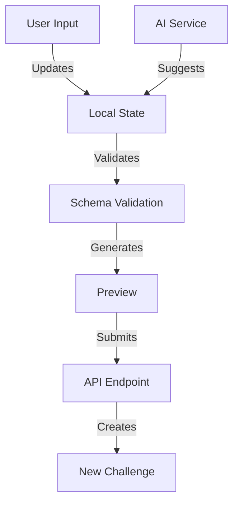
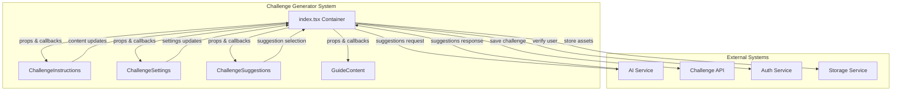
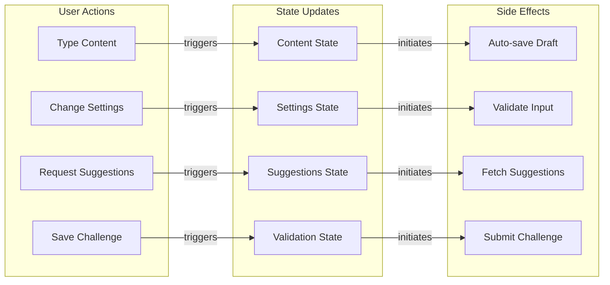
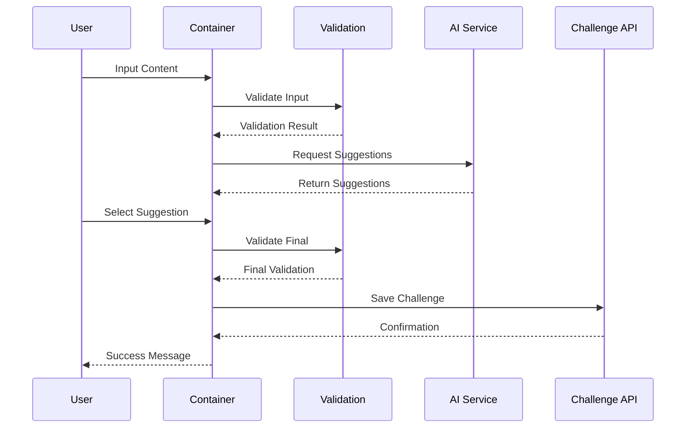
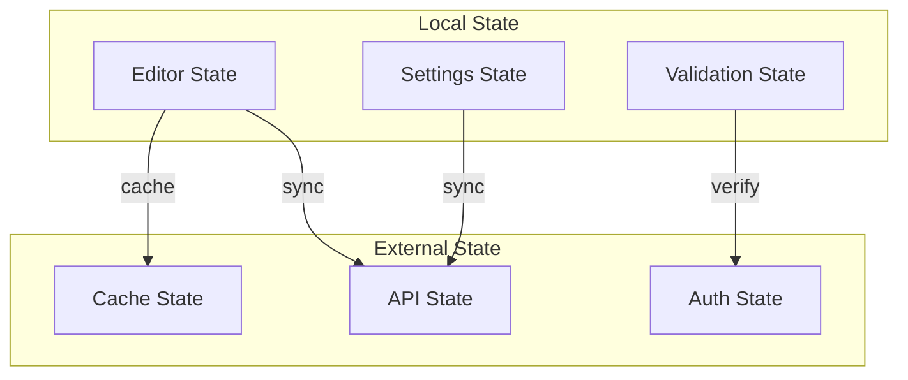
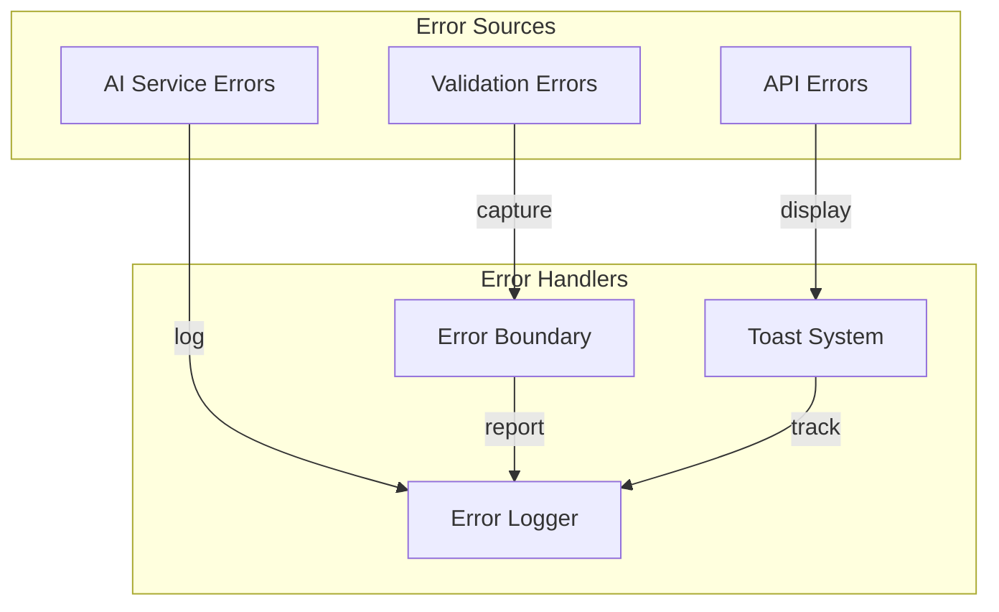
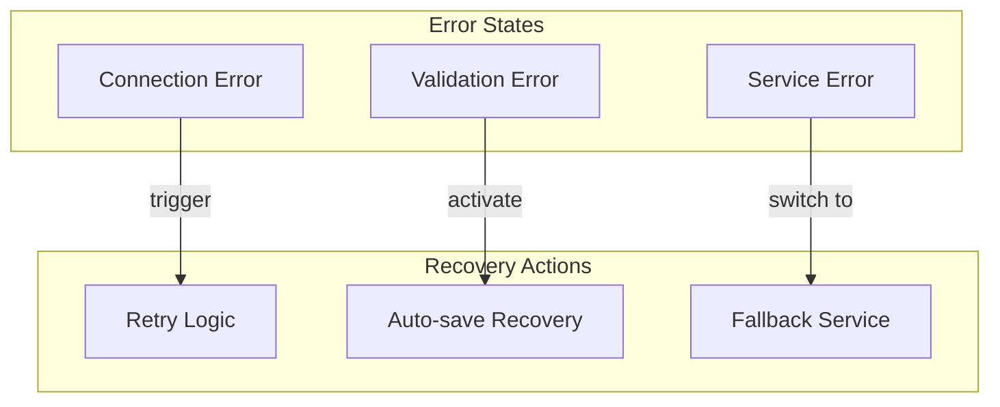
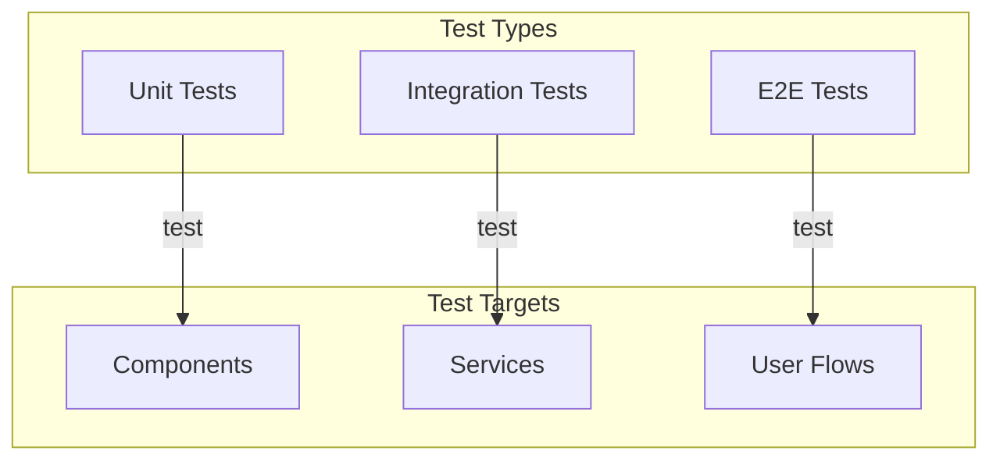

# Challenge Generator Documentation

> **⚠️ DOCUMENTATION UPDATE REQUIRED**
> When modifying any files in this directory, you MUST review and update this documentation.
> Follow this process:
> 1. Before making changes, review the relevant sections of this document
> 2. After making changes, update this document if needed
> 3. Check the Documentation Update Checklist below
> 4. Review related documentation in:
>    - `/components/dashboard/challenges/DOCUMENTATION.md`
>    - `/components/dashboard/test/DOCUMENTATION.md`

## Directory Structure
```
challenge-generator/
├── components/
│   ├── ChallengeInstructions.tsx  # Challenge instruction editor
│   ├── ChallengeSettings.tsx      # Challenge configuration settings
│   ├── ChallengeSuggestions.tsx   # AI-powered challenge suggestions
│   └── GuideContent.tsx           # Guide and help content
├── index.tsx                      # Main container component
└── schema.ts                      # Type definitions and validations
```

## Core Components

### 1. Challenge Generator Container (index.tsx)
The main container component that orchestrates the challenge generation process:
- Manages the overall state and workflow
- Coordinates between sub-components
- Handles form submission and validation
- Integrates with AI services for suggestions

### 2. Sub-Components
- `ChallengeInstructions`: Rich text editor for challenge instructions
- `ChallengeSettings`: Configuration panel for challenge parameters
- `ChallengeSuggestions`: AI-powered suggestion interface
- `GuideContent`: Help and guidance content for users

## State Management

### Challenge Generation State
```typescript
interface ChallengeGenerationState {
  title: string;
  description: string;
  difficulty: 'A1' | 'A2' | 'B1' | 'B2' | 'C1' | 'C2';
  timeLimit: number;
  tags: string[];
  isPublic: boolean;
  testCases: TestCase[];
}
```

### Workflow States
1. Initial Setup
2. Content Generation
3. Settings Configuration
4. Preview & Validation
5. Submission

## Component Integration

### Data Flow


### Error Handling
1. Input Validation
   - Schema-based validation
   - Real-time feedback
   - Field-specific error messages

2. API Error Handling
   - Retry mechanisms
   - User-friendly error messages
   - Error state management

## System Connections Overview

### Component Hierarchy and Data Flow


### State and Event Flow


## Component Connections

### 1. Main Container (index.tsx) Connections

#### State Management Connections
```typescript
interface StateConnections {
  // Internal State
  localState: {
    content: ContentState;      // Connected to ChallengeInstructions
    settings: SettingsState;    // Connected to ChallengeSettings
    suggestions: SuggestionState; // Connected to ChallengeSuggestions
    validation: ValidationState;  // Shared across components
  };
  
  // External Connections
  externalState: {
    auth: AuthState;           // Connected to Auth Service
    api: ApiState;             // Connected to Challenge API
    storage: StorageState;     // Connected to Storage Service
  };
}
```

#### Event Handler Connections
```typescript
interface EventConnections {
  // Content Events
  onContentChange: (content: string) => void;     // ChallengeInstructions -> Container
  onContentValidate: (content: string) => void;   // Container -> Validation
  
  // Settings Events
  onSettingsChange: (settings: Settings) => void; // ChallengeSettings -> Container
  onSettingsValidate: (settings: Settings) => void; // Container -> Validation
  
  // Suggestion Events
  onSuggestionRequest: () => void;    // Container -> AI Service
  onSuggestionSelect: (suggestion: Suggestion) => void; // ChallengeSuggestions -> Container
}

## Documentation Update Process

### When to Update This Document
- When modifying component structure or connections
- When changing state management
- When updating API contracts
- When modifying error handling
- When changing test requirements
- When updating AI integration

### Update Checklist
Before committing any changes to files in this directory, verify:

#### Code Changes
- [ ] Updated relevant TypeScript interfaces in `schema.ts`
- [ ] Added/modified function documentation
- [ ] Updated component props documentation
- [ ] Added/updated unit tests

#### Feature Changes
- [ ] Updated component descriptions
- [ ] Added new state management details
- [ ] Documented new functions or endpoints
- [ ] Updated workflow diagrams if needed

#### UI/UX Changes
- [ ] Updated component screenshots
- [ ] Documented new user interactions
- [ ] Updated accessibility guidelines
- [ ] Added new error scenarios

#### Integration Changes
- [ ] Updated API documentation
- [ ] Documented new dependencies
- [ ] Updated data flow diagrams
- [ ] Documented integration testing requirements

### Related Documentation
When making changes, also review:
1. `/components/dashboard/challenges/DOCUMENTATION.md`
   - Check challenge-related interfaces
   - Verify state management consistency
   - Review API contract changes

2. `/components/dashboard/test/DOCUMENTATION.md`
   - Verify test coverage requirements
   - Check integration test specifications
   - Review error handling documentation

## Data Flow Connections

### 1. Challenge Creation Flow


### 2. State Synchronization


## Service Integration Connections

### 1. AI Service Integration
```typescript
interface AIServiceConnections {
  // Request Connections
  requestSuggestions: {
    input: {
      content: string;
      difficulty: DifficultyLevel;
      context: ChallengeContext;
    };
    output: {
      suggestions: Suggestion[];
      metadata: SuggestionMetadata;
    };
  };
  
  // Feedback Connections
  requestFeedback: {
    input: {
      challenge: Challenge;
      settings: FeedbackSettings;
    };
    output: {
      feedback: AIFeedback;
      improvements: Improvement[];
    };
  };
}
```

### 2. API Service Connections
```typescript
interface APIConnections {
  // Challenge Management
  challengeAPI: {
    create: (challenge: Challenge) => Promise<Response>;
    update: (id: string, challenge: Challenge) => Promise<Response>;
    delete: (id: string) => Promise<Response>;
  };
  
  // Asset Management
  assetAPI: {
    upload: (asset: Asset) => Promise<Response>;
    fetch: (id: string) => Promise<Asset>;
  };
}
```

## Error Handling Connections

### 1. Error Flow


### 2. Recovery Connections


## Testing Connections

### 1. Test Coverage


### 2. Test Dependencies
```typescript
interface TestConnections {
  // Mock Services
  mockServices: {
    aiService: MockAIService;
    apiService: MockAPIService;
    authService: MockAuthService;
  };
  
  // Test Utilities
  testUtils: {
    renderComponent: (component: React.Component) => void;
    simulateUserAction: (action: UserAction) => void;
    validateState: (state: State) => boolean;
  };
}
```

## Functions Reference

### Challenge Generation

#### handleGenerateChallenge
```typescript
const handleGenerateChallenge = async (input: GenerationInput) => {
  // Processes user input and generates challenge content
  // Returns generated challenge structure
}
```

#### handleSaveChallenge
```typescript
const handleSaveChallenge = async (challenge: Challenge) => {
  // Validates and saves the challenge
  // Updates challenge list
}
```

### AI Integration

#### generateSuggestions
```typescript
const generateSuggestions = async (context: GenerationContext) => {
  // Calls AI service for suggestions
  // Returns formatted suggestions
}
```

## Best Practices

### 1. Performance
- Debounce user inputs
- Optimize API calls
- Cache suggestions
- Use progressive loading

### 2. Accessibility
- Keyboard navigation
- Screen reader support
- ARIA labels
- Focus management

### 3. User Experience
- Real-time validation
- Progress indicators
- Clear error messages
- Autosave functionality

### 4. Code Quality
- TypeScript strict mode
- Component testing
- Error boundaries
- Performance monitoring

## Maintenance Instructions

1. **Regular Updates**
   - Review documentation monthly
   - Update screenshots quarterly
   - Verify all code examples
   - Check for deprecated features

2. **Change Process**
   - Create documentation branch
   - Update relevant sections
   - Add change summary
   - Request documentation review

3. **Version Control**
   - Tag documentation versions
   - Maintain changelog
   - Archive old versions
   - Update related docs

## Related Components
1. `/components/dashboard/challenges`
2. `/components/dashboard/challenge-editor`
3. `/components/shared/markdown-editor`

## API Endpoints

### POST /api/challenges/generate
Creates a new challenge
```typescript
interface GenerateRequest {
  title: string;
  description: string;
  difficulty: string;
  timeLimit: number;
  isPublic: boolean;
}
```

### GET /api/challenges/suggestions
Retrieves AI-generated suggestions
```typescript
interface SuggestionsRequest {
  context: string;
  count: number;
  difficulty?: string;
}
