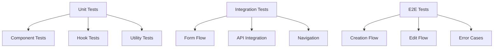
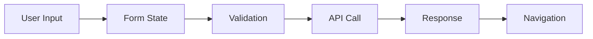

# Challenge Generator Documentation

> **⚠️ DOCUMENTATION UPDATE REQUIRED**
> When modifying any files in this directory, you MUST review and update this documentation.
> Follow this process:
> 1. Before making changes, review the relevant sections of this document
> 2. After making changes, update this document if needed
> 3. Check the Documentation Update Checklist below
> 4. Review related documentation in:
>    - `/components/dashboard/challenges/DOCUMENTATION.md`
>    - `/components/dashboard/test/DOCUMENTATION.md`

## Directory Structure
```
challenge-generator/
├── components/
│   ├── ChallengeInstructions.tsx  # Challenge instruction editor
│   ├── ChallengeSettings.tsx      # Challenge configuration settings
│   ├── ChallengeSuggestions.tsx   # AI-powered challenge suggestions
│   └── GuideContent.tsx           # Guide and help content
├── index.tsx                      # Main container component
├── page.tsx                       # Server-side entry point
└── schema.ts                      # Type definitions and validations
```

## Dependencies

### Core Dependencies
- `next.js`: Framework for routing and server-side rendering
- `@supabase/supabase-js`: Database and authentication
- `react-hook-form`: Form management
- `@hookform/resolvers/zod`: Form validation
- `sonner`: Toast notifications
- `lucide-react`: Icons

### UI Components
- `@/components/ui/tabs`: Tab navigation
- `@/components/layout`: Dashboard layout

### Custom Hooks
- `useAuthCheck`: Authentication state management
- `useChallengeFormats`: Format loading and management
- `useChallengeSuggestions`: AI suggestion handling
- `useInstructionGenerator`: Instruction generation
- `useChallengeSubmission`: Challenge submission handling

## Core Components

### 1. Challenge Generator Container (index.tsx)
The main container component that orchestrates both challenge creation and editing:
- Manages the overall state and workflow
- Coordinates between sub-components
- Handles form submission and validation
- Integrates with AI services for suggestions
- Supports both creation and editing of challenges

### 2. Sub-Components

#### ChallengeInstructions
```typescript
interface ChallengeInstructionsProps {
  form: UseFormReturn<FormValues>;
  isGenerating: boolean;
  onGenerateInstructions: (title: string) => Promise<void>;
}
```
Rich text editor for challenge instructions with AI generation support.

#### ChallengeSettings
```typescript
interface ChallengeSettingsProps {
  form: UseFormReturn<FormValues>;
  formats: ChallengeFormat[];
  groupedFormats: GroupedFormats;
  loadFormats: (difficulty: string) => Promise<void>;
  isGenerating: boolean;
  generateSuggestions: () => Promise<void>;
}
```
Configuration panel for challenge parameters with format management.

#### ChallengeSuggestions
```typescript
interface ChallengeSuggestionsProps {
  suggestions: Suggestion[];
  isGenerating: boolean;
  onSelect: (suggestion: Suggestion) => void;
}
```
AI-powered suggestion interface with selection handling.

#### GuideContent
```typescript
interface GuideContentProps {
  difficulty: string;
  format: string;
}
```
Context-aware help and guidance content.

## Server Component (page.tsx)

### Overview
The server-side entry point for the Challenge Generator, handling:
- User authentication
- Challenge data fetching for edit mode
- URL parameter processing
- Ownership verification

### Implementation
```typescript
// Props type for searchParams handling
interface Props {
  searchParams: { [key: string]: string | string[] | undefined };
}

// Server Component with async searchParams handling
async function ChallengeGeneratorPage({ searchParams }: Props)
```

### URL Parameters Handling
- **Next.js 13+ Considerations**
  - searchParams must be handled asynchronously
  - Direct property access needs special handling
  - Type safety must be maintained

- **Parameter Extraction**
  ```typescript
  // Safe parameter extraction pattern
  const params = await Promise.resolve(searchParams);
  const mode = String(params?.mode || '');
  const challengeId = String(params?.id || '');
  ```

- **Available Parameters**
  - `mode`: Operation mode ('edit' or undefined)
  - `id`: Challenge ID for edit mode

### Security Features
1. **URL Parameter Validation**
   - Async-safe parameter extraction
   - Type-safe conversion
   - Default value handling
   - Protection against undefined/null

2. **Authentication Flow**
   - Server-side user verification
   - Redirect to signin if unauthenticated
   - Ownership validation for edit mode

3. **Edit Mode Protection**
   - Challenge ownership verification
   - Automatic redirect on unauthorized access
   - Error handling for invalid challenge IDs

### Data Flow
1. Await and validate URL parameters
2. Verify user authentication
3. If edit mode:
   - Fetch challenge data
   - Verify ownership
   - Prepare for editing
4. Render ChallengeGeneratorView with appropriate props

### Type Safety
```typescript
// Type-safe challenge handling
let challengeToEdit: Challenge | undefined = undefined;

// Safe parameter type conversion
const mode: string = String(params?.mode || '');
const challengeId: string = String(params?.id || '');
```

### Error Handling
1. **Parameter Validation**
   - Async parameter resolution
   - Safe type conversion
   - Default value fallbacks
   - Protection against malformed input

2. **Authentication Failures**
   - Redirect to signin page
   - Clear error messaging
   - Session state handling

3. **Edit Mode Errors**
   - Invalid challenge ID handling
   - Unauthorized access protection
   - Database error management

### Next.js 13+ Best Practices
1. **Async Parameter Handling**
   - Always await searchParams resolution
   - Use type-safe parameter extraction
   - Handle undefined/null cases
   - Provide default values

2. **Route Protection**
   - Server-side authentication checks
   - Proper redirect handling
   - Error boundary implementation

3. **Performance Considerations**
   - Efficient parameter parsing
   - Proper async/await usage
   - Optimized database queries
   - Response caching when appropriate

## State Management

### Challenge Generation/Edit State
```typescript
interface ChallengeGenerationState {
  title: string;
  description: string;
  difficulty: 'A1' | 'A2' | 'B1' | 'B2' | 'C1' | 'C2';
  timeLimit: number;
  format_id: string;
  tags: string[];
  isPublic: boolean;
  testCases: TestCase[];
}
```

## Form Schema (schema.ts)
```typescript
const formSchema = z.object({
  title: z.string().min(1),
  description: z.string().optional(),
  difficulty: z.string(),
  format: z.string(),
  timeAllocation: z.number(),
  instructions: z.string(),
  // ... other fields
});

type FormValues = z.infer<typeof formSchema>;
```

## Component Props

### ChallengeGeneratorView Props
```typescript
interface ChallengeGeneratorProps {
  user: User;
  userDetails: UserDetails;
  challengeToEdit?: Challenge; // Optional challenge data for edit mode
}
```

## Usage Modes

### 1. Creation Mode
Default mode for creating new challenges:
- Empty form with default values
- AI-powered suggestions available
- Format selection based on difficulty

### 2. Edit Mode
Activated when a challenge is being edited:
- Pre-filled form with existing challenge data
- Maintains all creation mode features
- Accessed via URL parameters (mode=edit&id=[challengeId])
- Verifies challenge ownership before editing

## Workflow

### Creation Flow
1. User selects difficulty level
2. Available formats load based on difficulty
3. User fills in challenge details
4. Optional: Use AI suggestions
5. Submit creates new challenge

### Edit Flow
1. User clicks edit from challenge dialog
2. System loads existing challenge data
3. Form pre-fills with challenge data
4. User modifies as needed
5. Submit updates existing challenge

## Event Connections
```typescript
interface EventConnections {
  // Content Events
  onContentChange: (content: string) => void;     // ChallengeInstructions -> Container
  onContentValidate: (content: string) => void;   // Container -> Validation
  onFormatChange: (format: string) => void;       // Settings -> Container
  onDifficultyChange: (level: string) => void;    // Settings -> Container
  
  // Submission Events
  onSubmit: (data: FormData) => Promise<void>;    // Container -> API
  onEdit: (data: FormData) => Promise<void>;      // Container -> API
}
```

## Security Considerations

### Edit Mode Security
- Server-side ownership verification
- URL parameter validation
- User authentication check
- Proper error handling for unauthorized access

## Error Handling

### Common Scenarios
1. Invalid challenge ID
2. Unauthorized edit attempt
3. Format loading failure
4. Submission errors

## Testing Guide

### Test Types


## API Integration

### Endpoints
- `POST /api/challenges`: Create new challenge
- `PUT /api/challenges/:id`: Update existing challenge
- `GET /api/challenges/:id`: Fetch challenge for editing
- `GET /api/formats`: Fetch available formats
- `GET /api/suggestions`: Get AI-powered suggestions

## State Management Flow

