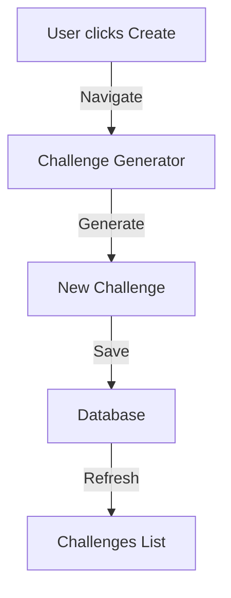
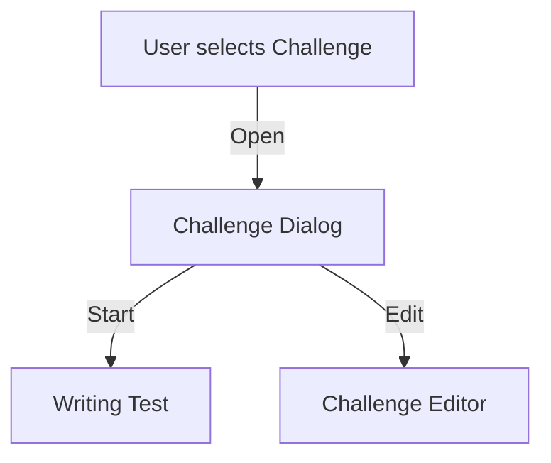

# Writing Challenges Documentation

This document provides comprehensive documentation for the Writing Challenges feature in Testmanship, including component architecture, state management, and implementation details.

## Directory Structure
```
challenges/
├── ChallengeCard.tsx       # Individual challenge display component
├── ChallengeDialog.tsx     # Modal for challenge details
├── ChallengeFilters.tsx    # Search and filter controls
├── ChallengeStats.tsx      # Statistics display component
├── DifficultyBadge.tsx     # Challenge difficulty indicator
├── EmptyChallengeState.tsx # Empty state UI component
├── constants.ts            # Shared constants and types
└── index.tsx              # Main challenges container component
```

## Core Components

### 1. Challenges Container (index.tsx)
The main container component that orchestrates the challenges feature:
- Manages the overall state and data flow
- Handles challenge selection and interactions
- Integrates filtering and sorting functionality

### 2. Challenge Components
- `ChallengeCard`: Displays individual challenge information in a card format
- `ChallengeDialog`: Modal for detailed challenge view and actions
- `ChallengeFilters`: Search, difficulty, and user-specific filter controls
- `ChallengeStats`: Visual representation of challenge statistics
- `EmptyChallengeState`: Placeholder UI when no challenges are available
- `DifficultyBadge`: Visual indicator for challenge difficulty levels

## State Management

### 1. Challenge Hooks
#### useChallenges
```typescript
const useChallenges = () => {
  // Manages challenge data fetching and state
  return {
    challenges: Challenge[],
    isLoading: boolean,
    error: Error | null
  }
}
```

#### useChallengeFilters
```typescript
const useChallengeFilters = (challenges: Challenge[], userId?: string) => {
  // Manages challenge filtering state and logic
  return {
    searchQuery: string,
    setSearchQuery: (query: string) => void,
    selectedLevel: string,
    setSelectedLevel: (level: string) => void,
    showUserChallengesOnly: boolean,
    setShowUserChallengesOnly: (show: boolean) => void,
    filteredChallenges: Challenge[]
  }
}
```

## Data Flow

### 1. Challenge Creation Flow


### 2. Challenge Interaction Flow


## Component Integration

### Component Communication
1. Parent-Child Props
   - Container passes challenge data to child components
   - Child components emit events back to container

2. State Management
   - Local state for UI interactions
   - Global state for challenge data
   - Custom hooks for reusable logic

### Error Handling
1. API Errors
   - Display user-friendly error messages
   - Implement retry mechanisms
   - Log errors for debugging

2. Validation
   - Input validation for filters
   - Data validation before submission
   - Type checking with TypeScript

## Best Practices

### 1. Performance
- Implement pagination for large challenge lists
- Use memo and callbacks for optimization
- Lazy load challenge details

### 2. Accessibility
- ARIA labels for interactive elements
- Keyboard navigation support
- Screen reader compatibility

### 3. Testing
- Unit tests for components
- Integration tests for flows
- E2E tests for critical paths

### 4. Code Organization
- Consistent file naming
- Clear component responsibilities
- Shared utilities and constants

### 5. User Experience
- Loading states and skeletons
- Clear feedback messages
- Responsive design
- Error boundaries

## Functions Reference

### Challenge Management

#### handleCreateChallenge
```typescript
const handleCreateChallenge = () => {
  // Initiates challenge creation process
  // Navigates to challenge generator
}
```

#### handleChallengeClick
```typescript
const handleChallengeClick = async (challenge: Challenge) => {
  // Handles challenge selection
  // Fetches creator details
  // Updates selected challenge state
}
```

#### handleEditChallenge
```typescript
const handleEditChallenge = () => {
  // Navigates to challenge editor
  // Initializes edit mode
}
```

### Challenge Filtering

#### filterChallenges
```typescript
const filterChallenges = (
  challenges: Challenge[],
  searchQuery: string,
  selectedLevel: string,
  showUserChallengesOnly: boolean,
  userId?: string
) => Challenge[]
```

## Implementation Checklist

### 1. Challenge Creation
- [ ] Validate challenge title and description
- [ ] Check for duplicate challenges
- [ ] Verify difficulty level selection
- [ ] Ensure proper creator attribution
- [ ] Validate time limit settings

### 2. Challenge Display
- [ ] Load challenges efficiently
- [ ] Implement proper error handling
- [ ] Show loading states
- [ ] Handle empty states
- [ ] Display creator information

### 3. Challenge Filtering
- [ ] Implement search functionality
- [ ] Apply difficulty filters
- [ ] Handle user-specific filters
- [ ] Update URL with filter state
- [ ] Clear filters functionality

### 4. Challenge Interaction
- [ ] Handle challenge selection
- [ ] Manage dialog state
- [ ] Process challenge start
- [ ] Handle edit permissions
- [ ] Implement challenge deletion

### 5. State Management
- [ ] Initialize challenge state
- [ ] Update challenge list
- [ ] Manage filter state
- [ ] Handle selected challenge
- [ ] Sync with database

### 6. Performance
- [ ] Optimize challenge loading
- [ ] Implement pagination
- [ ] Cache challenge data
- [ ] Minimize re-renders
- [ ] Handle large datasets

### 7. Error Handling
- [ ] Display error messages
- [ ] Handle network errors
- [ ] Validate user input
- [ ] Manage edge cases
- [ ] Implement error recovery

### 8. Security
- [ ] Verify user permissions
- [ ] Validate challenge ownership
- [ ] Sanitize user input
- [ ] Protect sensitive data
- [ ] Implement rate limiting

## Database Schema

### challenges
```sql
CREATE TABLE challenges (
  id UUID PRIMARY KEY,
  title VARCHAR NOT NULL,
  description TEXT,
  difficulty_level VARCHAR,
  created_by UUID REFERENCES users(id),
  created_at TIMESTAMP DEFAULT NOW(),
  time_limit INTEGER,
  is_public BOOLEAN DEFAULT true
);
```

## Related Files
1. `/app/dashboard/challenges/page.tsx`
2. `/components/dashboard/challenges/index.tsx`
3. `/components/dashboard/challenges/ChallengeCard.tsx`
4. `/components/dashboard/challenges/ChallengeDialog.tsx`
5. `/hooks/useChallenges.ts`
6. `/hooks/useChallengeFilters.ts`

## Recent Changes

### 2024 Updates

#### ChallengeDialog Component Updates
- Added optional `onEdit` prop to `ChallengeDialogProps` interface
- Updated edit functionality to use callback pattern instead of direct navigation
- Improved type safety with proper TypeScript prop definitions

```typescript
// Updated ChallengeDialogProps interface
interface ChallengeDialogProps {
  challenge: Challenge | null;
  creatorName: string;
  isCurrentUser: boolean;
  onClose: () => void;
  onEdit?: () => void;  // New optional callback prop
}
```

This change improves component reusability by:
1. Making the edit behavior configurable through props
2. Allowing parent components to control navigation logic
3. Maintaining better separation of concerns
4. Improving type safety with explicit prop definitions

## Future Improvements
1. Challenge templates
2. Batch challenge creation
3. Challenge categories
4. Advanced filtering options
5. Challenge analytics
6. Challenge sharing
7. Challenge versioning
8. Challenge export/import

This documentation should be updated whenever significant changes are made to the challenges functionality to maintain system integrity and developer understanding.
