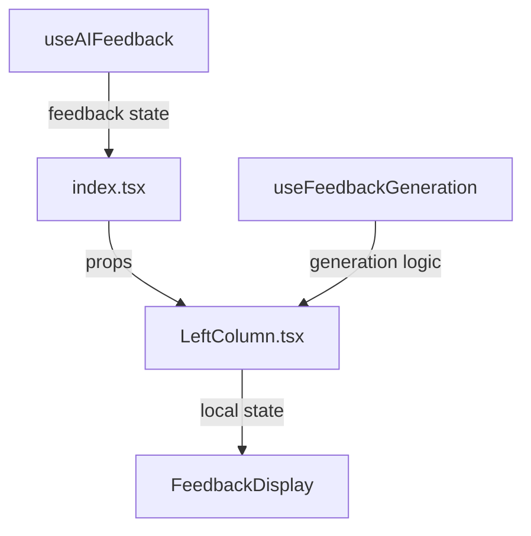

# Writing Challenge Feature Documentation

> **Important Note**: This documentation serves as a comprehensive reference for the entire writing challenge feature. It must be kept up-to-date and checked whenever making changes to ensure we don't break existing functionality. Use this as a checklist when modifying any related components.

## Overview
The writing challenge feature is a complex system that allows users to practice writing in different formats while receiving AI-powered feedback. The system consists of three main components working in tandem:

1. `index.tsx` - The main orchestrator component
2. `LeftColumn.tsx` - The challenge management and feedback display component
3. `useAIFeedback.ts` - Centralized feedback state management

## Component Architecture

### 1. index.tsx (Main Component)

#### Key States
- `selectedChallenge`: Current active challenge
- `inputMessage`: User's writing content
- `feedback`: AI feedback content (managed by useAIFeedback)
- `showFeedbackState`: Controls feedback window visibility
- `manuallyClosedFeedbackState`: Tracks if user manually closed feedback
- `mode`: Practice or exam mode
- `isTimeUp`: Timer completion state

#### Important Functions

##### `handleTextChange(e: React.ChangeEvent<HTMLTextAreaElement>)`
- Purpose: Manages text input and triggers feedback
- Key responsibilities:
  - Updates input message
  - Shows feedback window on first typing
  - Preserves previous text for comparison

##### `handleStartChallenge(challenge: Challenge)`
- Purpose: Initializes new challenge
- Actions:
  - Resets timer
  - Clears input and feedback
  - Resets feedback states

##### `handleStopChallenge()`
- Purpose: Cleans up challenge state
- Actions:
  - Resets timer
  - Clears challenge selection
  - Resets feedback states

### 2. LeftColumn.tsx (Challenge Management)

#### Props Interface (LeftColumnProps)
```typescript
interface LeftColumnProps {
  challenge: Challenge | null;
  outputCode: string;
  onStartChallenge: (challenge: Challenge) => void;
  onStopChallenge: () => void;
  onGenerateFeedback: (paragraph: string) => Promise<string>;
  isGeneratingFeedback: boolean;
  isTimeUp: boolean;
  mode: 'practice' | 'exam';
  timeElapsed: number;
  timeAllocation?: number;
  inputMessage: string;
  showFeedback: boolean;
  manuallyClosedFeedback: boolean;
  setManuallyClosedFeedback: (value: boolean) => void;
  setShowFeedback: (value: boolean) => void;
}
```

#### Key Components

##### DraggableWindow
- Purpose: Displays AI feedback in a movable window
- Features:
  - Draggable interface
  - Close button
  - Feedback content display
  - Position persistence
  - Responsive layout

##### ChallengeCard
- Purpose: Displays individual challenge information
- Features:
  - Challenge title and description
  - Difficulty level
  - Time allocation
  - Start/Stop buttons
  - Progress indicators

#### State Management
- Uses `localOutputCode` for local feedback display
- Syncs with parent feedback state via props
- Maintains clear feedback functionality
- Uses `useFeedbackGeneration` hook for feedback generation logic

### 3. Feedback State Management

#### useAIFeedback Hook
- Purpose: Centralized feedback state management
- Features:
  - Manages feedback content
  - Handles API interactions
  - Provides feedback generation logic
  - Exposes feedback state controls

#### useFeedbackGeneration Hook
- Purpose: Feedback generation and rate limiting
- Features:
  - Rate limit handling
  - Error management
  - Toast notifications
  - Paragraph-level feedback

## Component Interactions

### Feedback Flow
1. User types in textarea (`handleTextChange`)
2. Feedback window shows automatically (if not manually closed)
3. User clicks paragraph feedback button
4. `handleParagraphFeedback` triggers feedback generation
5. Feedback flows through hooks:
   ```mermaid
   graph TD
      A[useAIFeedback] -->|state| B[index.tsx]
      B -->|props| C[LeftColumn.tsx]
      C -->|local state| D[Feedback Display]
   ```

### Challenge Flow
1. User selects challenge from ChallengeCard
2. `handleStartChallenge` initializes challenge state
3. Timer starts and writing area becomes active
4. User can receive feedback while writing
5. Challenge ends via manual stop or timer completion
6. Final feedback is generated on completion

### State Dependencies


## Reusable Components

### Card Components (`/components/cards/`)
A collection of reusable card components designed for consistent UI presentation across the test interface.

#### Available Cards
1. `GradientCard`
   - Purpose: Base card with gradient background
   - Usage: Foundation for other card components
   - Props: `className`, `children`

2. `InstructionsCard`
   - Purpose: Displays test instructions
   - Usage: Shows challenge requirements and guidelines
   - Props: `instructions`, `className`

3. `InfoCard`
   - Purpose: Displays informational content
   - Usage: Shows tips, hints, or additional information
   - Props: `title`, `content`, `className`

4. `FocusCard`
   - Purpose: Highlights important content
   - Usage: Drawing attention to specific information
   - Props: `title`, `content`, `highlight`

5. `DifficultyBadge`
   - Purpose: Visual indicator of difficulty level
   - Usage: Shows test or challenge difficulty
   - Props: `difficulty`, `size`

6. `FooterStats`
   - Purpose: Displays statistics in card footer
   - Usage: Shows completion rates, scores, etc.
   - Props: `stats`, `className`

#### Shared Types (`types.ts`)
```typescript
// Common interfaces used across card components
interface CardBase {
  className?: string;
  children?: React.ReactNode;
}

interface Stats {
  // Add the actual stats interface
}
```

#### Usage Guidelines
1. Import cards from the barrel file:
   ```typescript
   import { GradientCard, InfoCard, FocusCard } from './components/cards';
   ```

2. Maintain consistency:
   - Use appropriate card for content type
   - Follow existing styling patterns
   - Extend base types when adding props

3. When to use each card:
   - `GradientCard`: Base container needing visual emphasis
   - `InstructionsCard`: Primary test instructions
   - `InfoCard`: Secondary information
   - `FocusCard`: Important notices or highlights
   - `DifficultyBadge`: Difficulty indicators
   - `FooterStats`: Statistical information

4. Customization:
   - All cards accept className for styling overrides
   - Maintain responsive design
   - Follow accessibility guidelines

#### Development Guidelines
When modifying or adding card components:
- [ ] Update types in `types.ts`
- [ ] Export new components in `index.ts`
- [ ] Add props documentation
- [ ] Update this section with usage examples
- [ ] Test responsive behavior
- [ ] Verify accessibility

## Important Notes

### Feedback State Management
- Centralized in useAIFeedback hook
- Local state in LeftColumn for UI responsiveness
- Clear synchronization between components
- Rate limiting at API level

### Feedback Window Behavior
- Shows automatically on first typing
- Stays closed if manually closed by user
- Can be reopened via sparkle button
- Resets state on new challenge
- Maintains position while dragging

### Challenge State Management
- Challenge object is extended with inputMessage
- State is cleaned up on challenge completion
- Timer state affects input availability
- Proper cleanup on component unmount

### Error Handling
- Improved rate limit error messages
- Better error state management
- Clear user feedback via toasts
- Comprehensive error logging
- Graceful degradation on API failures

## Related Files
- `/hooks/useAIFeedback.ts`: Central feedback state
- `/hooks/useFeedbackGeneration.ts`: Feedback generation logic
- `/hooks/useChallenge.ts`: Challenge state management
- `/types/challenge.ts`: Type definitions
- `/components/ui/*`: UI components

## Future Considerations
1. Add feedback history
2. Implement feedback caching
3. Add offline support
4. Enhance error recovery
5. Add feedback analytics

## Breaking Changes Checklist
When modifying this feature, check the following:

1. State Management
   - [ ] Feedback state flow remains intact
   - [ ] Challenge state properly updates
   - [ ] Local states sync correctly

2. User Experience
   - [ ] Feedback window behavior
   - [ ] Challenge flow remains smooth
   - [ ] Error messages are helpful

3. Performance
   - [ ] Rate limiting works
   - [ ] No memory leaks
   - [ ] Proper cleanup

4. Error Handling
   - [ ] All error states handled
   - [ ] User notifications work
   - [ ] Graceful degradation

5. Components
   - [ ] DraggableWindow functions
   - [ ] ChallengeCard displays correctly
   - [ ] All props passed correctly

This documentation should be reviewed and updated whenever making changes to ensure system integrity.
