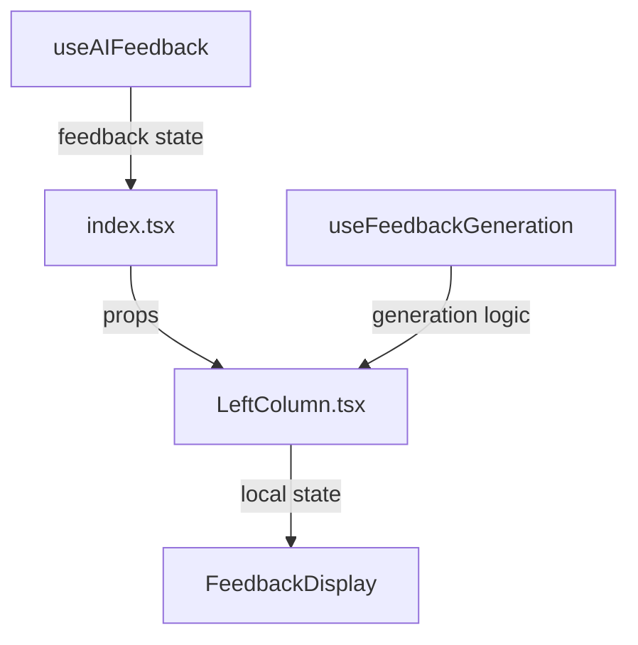

# Writing Assistant Feedback Mechanism Documentation

This document explains the feedback mechanism implemented in the Writing Assistant component, detailing how paragraph feedback is requested, processed, and displayed.

## Core Components and Flow

### 1. Hooks Architecture

#### a. useAIFeedback Hook
```typescript
const useAIFeedback = ({ challenge, targetLanguage }: AIFeedbackOptions) => {
  const [feedback, setFeedback] = useState<string>('');

  const generateFeedback = useCallback(async (paragraphText: string) => {
    // API interaction and feedback generation
    const responseData = await fetchFeedback(paragraphText);
    setFeedback(responseData.feedback);
    return responseData.feedback;
  }, [challenge, targetLanguage]);

  return { feedback, generateFeedback, setFeedback };
};
```

#### b. useFeedbackGeneration Hook
```typescript
const useFeedbackGeneration = (
  challenge: Challenge | null,
  onGenerateFeedback: (paragraph: string) => Promise<string>,
  setFeedback: (feedback: string) => void,
) => {
  const handleParagraphFeedback = async (paragraph: string, index: number) => {
    const feedback = await handleGenerateFeedback(paragraph);
    setFeedback(feedback);
  };

  return { handleParagraphFeedback, handleFinishChallenge };
};
```

### 2. Component Implementation

#### a. Feedback Button (LeftColumn.tsx)
```tsx
<button
  onClick={async () => {
    console.log(`Analyzing paragraph ${index + 1}:`, paragraph.slice(0, 50) + '...');
    await handleParagraphFeedback(paragraph, index);
  }}
  className="group relative flex items-center gap-1.5 px-3 py-2 text-sm font-medium text-zinc-600 hover:text-zinc-700 dark:text-zinc-400 dark:hover:text-zinc-300 rounded-lg transition-all overflow-hidden w-full"
>
  {/* Animated border and content */}
</button>
```

#### b. Feedback Display (LeftColumn.tsx)
```tsx
const [localOutputCode, setLocalOutputCode] = useState(outputCode);

useEffect(() => {
  setLocalOutputCode(outputCode);
}, [outputCode]);

// Display component
{localOutputCode ? (
  <div className="text-zinc-600 dark:text-zinc-400 text-md leading-relaxed">
    {localOutputCode.split('\n').map((line, index) => (
      <FeedbackLine key={index} line={line} />
    ))}
  </div>
) : (
  // Empty state component
)}
```

## State Management

### 1. Centralized State (useAIFeedback)
- `feedback`: Main feedback content
- `setFeedback`: State setter exposed to other components
- `generateFeedback`: API interaction function

### 2. Local State (LeftColumn)
- `localOutputCode`: Local feedback display state
- Syncs with parent feedback via useEffect
- Handles clear functionality independently

### 3. Rate Limiting
```typescript
const MIN_FEEDBACK_INTERVAL = 5000; // 5 seconds

if (timeSinceLastFeedback < MIN_FEEDBACK_INTERVAL) {
  const waitTime = Math.ceil((MIN_FEEDBACK_INTERVAL - timeSinceLastFeedback) / 1000);
  throw new Error(`rate limit exceeded. Please wait ${waitTime} seconds.`);
}
```

## Error Handling

### 1. API Errors
```typescript
if (!response.ok) {
  if (response.status === 429) {
    throw new Error('rate limit exceeded');
  }
  throw new Error(responseData.message || `Failed to generate feedback: ${response.status}`);
}
```

### 2. User Notifications
```typescript
try {
  const feedback = await handleGenerateFeedback(paragraph);
  toast.success(`Generated feedback for paragraph ${index + 1}`);
} catch (error) {
  let errorMessage = error instanceof Error ? error.message : 'Failed to generate feedback';
  toast.error(errorMessage, { duration: error.message.includes('rate limit') ? 5000 : 3000 });
}
```

## Component Interaction Flow



## State Synchronization

### 1. Parent to Child
```typescript
// index.tsx
const { feedback, setFeedback } = useAIFeedback({...});
<LeftColumn outputCode={feedback} {...props} />

// LeftColumn.tsx
useEffect(() => {
  setLocalOutputCode(outputCode);
}, [outputCode]);
```

### 2. Child to Parent
```typescript
// Through useFeedbackGeneration
const { handleParagraphFeedback } = useFeedbackGeneration(
  challenge,
  generateFeedback,
  setFeedback
);
```

## Important Considerations

### 1. State Updates
- Always use `setFeedback` from useAIFeedback for global updates
- Use `setLocalOutputCode` for UI-specific updates
- Clear feedback properly on component unmount

### 2. Error Handling
- Handle rate limits gracefully
- Provide clear error messages
- Use appropriate toast durations

### 3. Performance
- Implement proper cleanup
- Avoid unnecessary re-renders
- Handle large feedback content efficiently

## Related Files
1. `/hooks/useAIFeedback.ts`
2. `/hooks/useFeedbackGeneration.ts`
3. `/components/dashboard/test/LeftColumn.tsx`
4. `/components/dashboard/test/index.tsx`

## Future Improvements
1. Feedback caching
2. Offline support
3. Batch feedback requests
4. Enhanced error recovery
5. Performance optimizations

This documentation should be updated whenever changes are made to the feedback mechanism to ensure system integrity and maintainability.

## Troubleshooting Common Issues

1. **Feedback Not Showing**
   - Check if `outputCodeState` is being properly set
   - Verify `handleParagraphFeedback` is being called
   - Ensure feedback window is mounted and visible
   - Check console for error messages

2. **State Management Issues**
   - Verify proper state updates in `handleGenerateFeedback`
   - Check if feedback state is properly propagated
   - Ensure proper cleanup in `useEffect` hooks

3. **Timer-Related Issues**
   - Verify `isTimeUp` state
   - Check timer initialization
   - Ensure proper mode selection

## Detailed File Interactions

### Key Files and Their Roles

1. `/components/dashboard/test/index.tsx`
   - **Primary Role**: Main orchestrator of the writing assistant
   - **Key Functions**:
     - `handleTextChange`: Manages text input and triggers feedback updates
     - `handleGenerateFeedback`: Coordinates the feedback generation process
     - `handleStartChallenge`: Initializes challenge state and resets feedback
   - **State Management**:
     - Manages global states like `outputCode`, `model`, `selectedChallenge`
     - Controls timer and writing states
     - Coordinates between user input and feedback display

2. `/components/dashboard/test/LeftColumn.tsx`
   - **Primary Role**: UI container for challenge selection and feedback display
   - **Key Components**:
     - Feedback button implementation
     - Challenge selection interface
     - Feedback display container
   - **State Management**:
     - Manages local UI states for feedback visibility
     - Handles challenge selection and display
     - Controls feedback window positioning

3. `/components/dashboard/test/components/FeedbackWindow.tsx`
   - **Primary Role**: Renders the feedback interface
   - **Key Features**:
     - Draggable feedback window
     - Feedback sections organization
     - Real-time feedback updates
   - **Components**:
     - Language information display
     - Translation sections
     - Grammar and vocabulary feedback
     - Interactive UI elements

4. `/components/dashboard/test/components/ParagraphFeedback.tsx`
   - **Primary Role**: Renders individual paragraph feedback
   - **Key Sections**:
     - Language detection results
     - Grammar analysis display
     - Vocabulary suggestions
     - Writing improvement tips
   - **Features**:
     - Color-coded feedback sections
     - Error highlighting
     - Suggestion formatting

5. `/hooks/useAIFeedback.ts`
   - **Primary Role**: Manages AI feedback generation logic
   - **Key Functions**:
     - `generateFeedback`: Makes API calls to AI service
     - `processFeedback`: Formats AI response
     - `cleanup`: Handles feedback state cleanup
   - **Features**:
     - Error handling for API calls
     - Rate limiting management
     - Response validation
     - Feedback caching

6. `/hooks/useFeedbackGeneration.ts`
   - **Primary Role**: Manages feedback generation state and logic
   - **Key Functions**:
     - `handleParagraphFeedback`: Processes individual paragraph feedback
     - `setOutputCodeState`: Updates feedback display state
     - `handleFinishChallenge`: Processes final challenge feedback
   - **State Management**:
     - Feedback generation status
     - Output state management
     - Error state handling

### Data Flow

1. **Input Processing**:
   ```
   User Input → index.tsx → useTextEditor → handleParagraphChange
   ```

2. **Feedback Generation**:
   ```
   handleParagraphChange → useAIFeedback → AI API → useFeedbackGeneration
   ```

3. **Display Flow**:
   ```
   useFeedbackGeneration → LeftColumn.tsx → FeedbackWindow → ParagraphFeedback
   ```

### Error Handling Chain

1. **API Errors**:
   ```
   useAIFeedback → useFeedbackGeneration → index.tsx → User Interface
   ```

2. **State Errors**:
   ```
   useFeedbackGeneration → LeftColumn.tsx → FeedbackWindow → Error Display
   ```

### Performance Considerations

1. **Caching**:
   - Feedback results are cached in `useAIFeedback`
   - Prevents redundant API calls for same paragraphs

2. **State Updates**:
   - Batched updates in `useFeedbackGeneration`
   - Optimized rendering in feedback components

3. **Error Recovery**:
   - Automatic retry mechanism in `useAIFeedback`
   - Graceful degradation in feedback display

## Dependencies
- `@supabase/auth-helpers-nextjs`
- `@supabase/supabase-js`
- React state management hooks
- Custom UI components from shadcn/ui

## Best Practices
1. Always handle loading states
2. Implement proper error handling
3. Use debouncing for text changes
4. Maintain clear separation of concerns
5. Follow TypeScript type safety
6. Implement proper cleanup for effects
7. Handle edge cases (empty text, timeouts, etc.)
